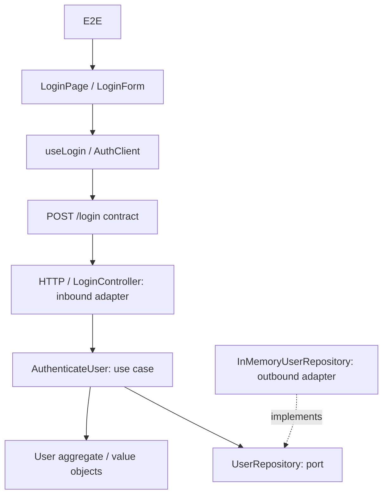

# Test Impact Lab

A real login application and deterministic test-impact engine in a TypeScript monorepo. **Phase 6 complete:** the audited explorer guides a real source edit through deterministic impact analysis, contract boundaries and physically measured selected/full regression runs. The catalogue contains 39 meaningful product tests.

## Run

Use **Node.js 24.15+ (24.x) or 26+** and **pnpm 11.19.0** (pinned in `packageManager`).

```sh
pnpm install --frozen-lockfile
pnpm exec playwright install chromium
pnpm dev
```

Open [the interactive explorer](http://127.0.0.1:5175) or [the login application](http://127.0.0.1:5173). The login API listens on `127.0.0.1:3001`; the snapshot/analysis API listens on `127.0.0.1:3002`. Override `DEMO_PORT`, `DEMO_API_PORT`, `FRONTEND_PORT` or `BACKEND_PORT` if occupied.

Credentials: `demo@example.com` / `impact-demo`. Wrong credentials produce an error; success navigates to `/home`. This is a credential-checking demo, without persistent sessions or protected pages.

```sh
pnpm build                         # Typecheck, graph generation, production bundles
pnpm test                          # Vitest: product, engine and architecture checks
pnpm test:e2e                      # Chromium + real frontend/backend on free ports
pnpm test:execution                # Selected/full overlay execution verification
pnpm validate                      # Build, graph consistency, Vitest and E2E
pnpm impact LoginButton            # Explain a hypothetical entity change
pnpm impact 'User.authenticate'
pnpm impact 'POST /login'
pnpm test:selected LoginButton     # Physically run the computed subset
```

The explorer serves an immutable hash-addressed snapshot of allowlisted source files. Monaco edits stay in browser memory; Calculate Regression sends replacements to the local API, which maps the real line diff to graph ranges and invokes the shared impact engine. Suggested changes modify source text and do not send scenario names or test IDs.

In **TESTS**, the ID legend defines `BU` (backend unit), `FU` (frontend unit), `C` (component), `CT` (HTTP contract), `I` (integration) and `E` (browser E2E). Select any catalogue row or executed result to open its actual test file at that test's highlighted declaration and assertions, alongside the selection reason and runner output. **VIEW SOURCE CHANGE** opens the edited product file; **COMPARE** shows removed original lines in red and added edited lines in green. Use **EDIT** to return to the editable file. Test source is part of the immutable snapshot hash.

RUN SELECTED TESTS and RUN FULL SUITE simulate the browser edits without launching Vitest or Playwright. The browser still sends only a snapshot ID, analysis ID and fixed mode; the server derives trusted catalogue IDs and returns reactive results with plausible type-based durations. The original runner remains available in the git history for local development.

## Public deployment

`render.yaml` deploys the complete explorer, including its API and built frontend, as a free Render web service. It preserves Monaco, the dependency graph and the original desktop layout. Free services sleep after inactivity and may take about a minute to wake up.

This runner is a local, trusted-user tool. Edited TypeScript is executable code: the runner filters inherited environment variables, validates fixed test identities and removes its overlay, but it is not an OS sandbox and the edited code still runs with the current user's filesystem and network permissions. Keep the API bound to loopback and never expose it as a public execution service.

## Architecture



`User` owns authentication and locked-account invariants. `Email` normalizes and validates; `PasswordHash` performs salted scrypt verification. The application use case queries a domain-owned port; the composition root injects the repository. Domain/application cannot import adapters or transport contracts; automated import checks enforce this, including type imports and re-exports.

## Test catalogue and impact

The catalogue has **39 product tests**: 17 backend unit, 4 frontend unit, 8 component, 3 contract, 6 HTTP integration and 1 Playwright E2E. Engine and architecture checks sit outside the demo catalogue.

Graph edges point consumer → dependency. Normal impact travels in reverse. Explicit evidence paths reach API contracts; unchanged contracts permit contract and E2E journey evidence across the boundary while stopping implementation test propagation. Changed contracts expose relevant code on both sides. Every selected test has a causal path, and every excluded test has a reason. No AI runs in the engine.

Current graph-derived examples (not engine rules):

| Changed entity | Product tests selected |
| --- | ---: |
| `LoginButton` | 4 / 39: 3 component + E2E |
| `normalizeEmail` | 11 / 39: frontend unit/component + contract + E2E |
| `User.authenticate` | 13 / 39: 5 backend unit + 4 integration + 3 contract + E2E |
| `POST /login` | 29 / 39 across both sides of the boundary |

The CLI accepts explicit changed entity IDs. The explorer derives changed entities from real line diffs and the narrowest graph source ranges, backed by immutable source, graph and catalogue hashes. Unknown or unmapped changes conservatively select the full catalogue. Completeness depends on the reviewed graph evidence, not a claim of universal coverage.

`impact/graph.json` and `impact/catalogue.json` are generated from TypeScript imports, literal test titles and [reviewed metadata](impact/evidence/architecture.json). Metadata edges explain HTTP routing, repository injection and locally exercised test subjects. These are explicit relationships, not measured runtime coverage.

To add a node/test: register its stable ID, file, architectural layer and local subjects in the metadata; add a real top-level test with a unique `[ID]` title; run `pnpm graph:generate`, `pnpm graph:check`, and relevant tests. Never add scenario-to-test lists. TypeScript 5.9 is retained for its stable compiler API.

- [Architecture and algorithm](docs/ARCHITECTURE.md)
- [Implementation state and optional Phase 7 handoff](docs/IMPLEMENTATION_STATE.md)
- [Graph, catalogue and API types](packages/impact-engine/src/schema.ts)
- [Supplied SDD](docs/SDD.md)
