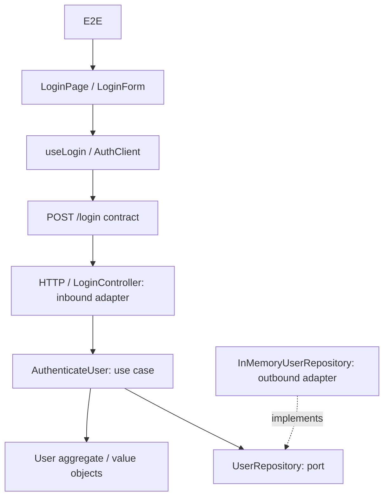

# Test Impact Demo

## Demo pública estática

Este repositorio incluye una versión autónoma para GitHub Pages. No necesita Node, pnpm, API ni backend: abre `index.html` y simula el análisis de impacto en el navegador.

La ejecución de tests es deliberadamente simulada. Cada test afectado recibe una duración aleatoria entre **350 ms y 1.450 ms**, un rango suficientemente plausible para una demo visual. No se ejecuta Vitest, Playwright ni código del proyecto.

Al hacer push a `main`, `.github/workflows/pages.yml` publica el repositorio mediante GitHub Pages. En la configuración del repositorio hay que seleccionar **Settings → Pages → GitHub Actions** como fuente de publicación.

A real login application and deterministic test-impact engine in a TypeScript monorepo. **Phase 6 complete:** the audited explorer guides a real source edit through deterministic impact analysis, c[...]

## Run

Use **Node.js 24.15+ (24.x) or 26+** and **pnpm 11.19.0** (pinned in `packageManager`).

```sh
pnpm install --frozen-lockfile
pnpm exec playwright install chromium
pnpm dev
```

Open [the interactive explorer](http://127.0.0.1:5175) or [the login application](http://127.0.0.1:5173). The login API listens on `127.0.0.1:3001`; the snapshot/analysis API listens on `127.0.0.1[...]

Credentials: `demo@example.com` / `impact-demo`. Wrong credentials produce an error; success navigates to `/home`. This is a credential-checking demo, without persistent sessions or protected page[...]

```sh
pnpm build                         # Typecheck, graph generation, production bundles
pnpm test                          # Vitest: product, engine and architecture checks
pnpm test:e2e                      # Chromium + real frontend/backend on free ports
pnpm test:execution                # Selected/full overlay execution verification
pnpm validate                      # Build, graph consistency, Vitest and E2E
pnpm impact LoginButton            # Explain a hypothetical entity change
pnpm impact 'User.authenticate'
pnpm impact 'POST /login'
pnpm test:selected LoginButton     # Physically run the computed subset
```

The explorer serves an immutable hash-addressed snapshot of allowlisted source files. Monaco edits stay in browser memory; Calculate Regression sends replacements to the local API, which maps the [...]

In **TESTS**, the ID legend defines `BU` (backend unit), `FU` (frontend unit), `C` (component), `CT` (HTTP contract), `I` (integration) and `E` (browser E2E). Select any catalogue row or executed [...]

RUN SELECTED TESTS and RUN FULL SUITE execute browser edits in disposable source overlays. The browser sends only a snapshot ID, analysis ID and fixed mode; the server derives trusted catalogue ID[...]

This runner is a local, trusted-user tool. Edited TypeScript is executable code: the runner filters inherited environment variables, validates fixed test identities and removes its overlay, but it[...]

## Architecture



`User` owns authentication and locked-account invariants. `Email` normalizes and validates; `PasswordHash` performs salted scrypt verification. The application use case queries a domain-owned port[...]

## Test catalogue and impact

The catalogue has **39 product tests**: 17 backend unit, 4 frontend unit, 8 component, 3 contract, 6 HTTP integration and 1 Playwright E2E. Engine and architecture checks sit outside the demo cata[...]

Graph edges point consumer → dependency. Normal impact travels in reverse. Explicit evidence paths reach API contracts; unchanged contracts permit contract and E2E journey evidence across the bo[...]

Current graph-derived examples (not engine rules):

| Changed entity | Product tests selected |
| --- | ---: |
| `LoginButton` | 4 / 39: 3 component + E2E |
| `normalizeEmail` | 11 / 39: frontend unit/component + contract + E2E |
| `User.authenticate` | 13 / 39: 5 backend unit + 4 integration + 3 contract + E2E |
| `POST /login` | 29 / 39 across both sides of the boundary |

The CLI accepts explicit changed entity IDs. The explorer derives changed entities from real line diffs and the narrowest graph source ranges, backed by immutable source, graph and catalogue hashe[...]

`impact/graph.json` and `impact/catalogue.json` are generated from TypeScript imports, literal test titles and [reviewed metadata](impact/evidence/architecture.json). Metadata edges explain HTTP r[...]

To add a node/test: register its stable ID, file, architectural layer and local subjects in the metadata; add a real top-level test with a unique `[ID]` title; run `pnpm graph:generate`, `pnpm gra[...]

- [Architecture and algorithm](docs/ARCHITECTURE.md)
- [Implementation state and optional Phase 7 handoff](docs/IMPLEMENTATION_STATE.md)
- [Graph, catalogue and API types](packages/impact-engine/src/schema.ts)
- [Supplied SDD](docs/SDD.md)
